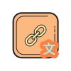

# firefox-copy-decoded-url

Quickly copy the decoded URL with a click.

## Usage
After installing and enabling, this plugin will show a button on toolbar. Decoded URL will be copied into clipboard with a click on icon button.

That's all.

## Installation
### addons.mozilla.org (recommend)

⚠ If you use Firefox between 101 and 108, you should enable manifest v3: set `extensions.manifestV3.enabled` to `true` in `about:config`, or switch to v0.1.x version extension.  
⚠ If you use Firefox between 90 and 100, you should only install v0.1.x version extension.

### Temporary installation
Download or clone repo, then follow this [guide](https://extensionworkshop.com/documentation/develop/temporary-installation-in-firefox/).

## Alternative

Firefox has bulit in a config that can control this. Please go to `about:config` change `browser.urlbar.decodeURLsOnCopy` from `false` to `true`.

Thanks [@FlandreDaisuki](https://github.com/FlandreDaisuki) show me another way to achieve this (see https://github.com/hms5232/firefox-copy-decoded-url/issues/1).

## Thanks

* The icon is from and based on https://icons8.com/icons/set/link
* https://www.delftstack.com/zh-tw/howto/javascript/javascript-copy-to-clipboard/
* https://developer.mozilla.org/en-US/docs/Mozilla/Add-ons/WebExtensions/Your_second_WebExtension
* https://developer.mozilla.org/en-US/docs/Mozilla/Add-ons/WebExtensions/Add_a_button_to_the_toolbar
* https://stackoverflow.com/questions/53983318/firefox-addon-button-browser-action-not-calling-js-on-click

## License

Copyright © 2022 hms5232

This extension is licensed under [MPL 2.0](LICENSE)
